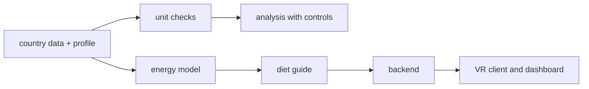
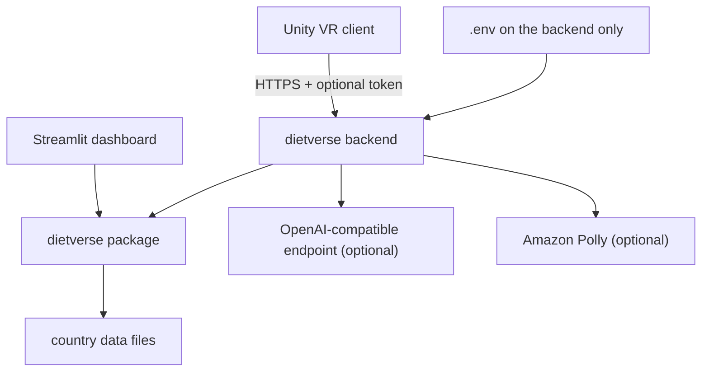
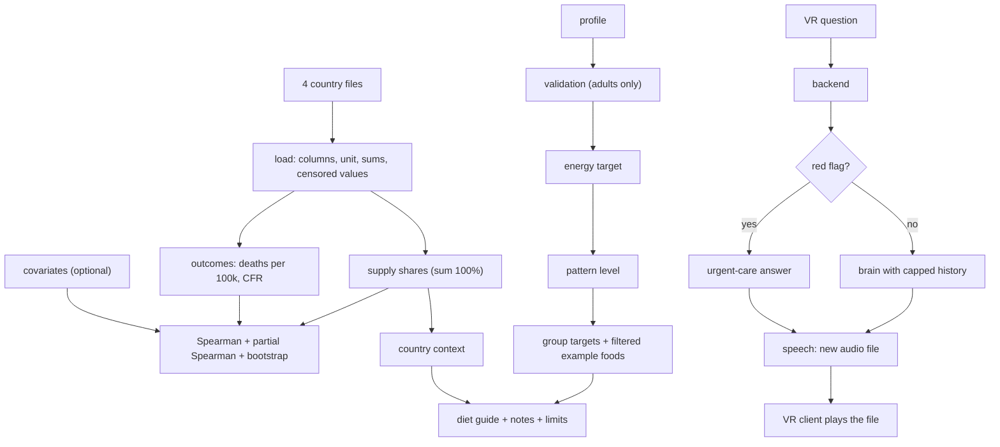

<div align="center">

# dietverse — Diet Analytics And A Backend For A Talking VR Assistant

**dietverse is a country-level diet analytics tool and a person-based diet guide, with a safe backend for a VR nutrition assistant. It takes the COVID-19 Healthy Diet data and a person's profile through these steps:**

`load with unit checks` → `explore supply shares` → `analyze with controls` → `make a diet guide` → `answer in the VR client`.


**[Summary](#1-summary)** ·
**[Workflow](#4-the-end-to-end-workflow)** ·
**[Run it](#10-how-to-run-dietverse)** ·
**[Configuration](#104-environment-variables)** ·
**[Known problems](#13-known-problems)** ·
**[Glossary](#15-glossary)**

</div>

> [!NOTE]
> This README uses ASD-STE100 Simplified Technical English. The writing rules and the project
> vocabulary are in [`docs/ste-style-guide.md`](docs/ste-style-guide.md). Each term in the
> [Glossary](#15-glossary) has only one meaning.

> [!WARNING]
> Do not use dietverse as medical, nutrition or mental health advice. The diet guide and the screener give general
> information only. A doctor, a registered dietitian or a mental health professional must review decisions about a person.
> Country-level results do not apply to persons.

---

dietverse has three parts. The analytics part reads the COVID-19 Healthy Diet country data with correct units and
reports country-level associations with controls and intervals. The diet guide calculates energy needs from the
person and gives food-group targets from a published food pattern, filtered by diet, allergies and intolerances. The
backend gives a VR client a health-safe assistant, the screener and the diet guide, and it keeps all credentials on
the server.

This README is the **one location that explains all of dietverse**. It gives these topics:

- the general design
- each component and its procedure, step by step
- the decision rules
- the data map
- the runbook
- the validation results and the known problems

| If you are… | Read |
|---|---|
| A manager or reviewer | [1](#1-summary), [3](#3-design-rules), [4](#4-the-end-to-end-workflow), [12](#12-validation-results), [14](#14-key-points) |
| A developer who joins the project | All sections, in sequence. Keep [10](#10-how-to-run-dietverse) and [13](#13-known-problems) open while you work |
| An operator who runs dietverse | [10](#10-how-to-run-dietverse), then the section for the component that you use |

---

## Table of contents

1. 🧭 [Summary](#1-summary)
2. 🏗️ [How dietverse is built](#2-how-dietverse-is-built)
   - 2.1 [Components](#21-components)
   - 2.2 [System context](#22-system-context)
   - 2.3 [Repository layout](#23-repository-layout)
3. 🛡️ [Design rules](#3-design-rules)
4. 🔄 [The end-to-end workflow](#4-the-end-to-end-workflow)
   - 4.1 [Full flow](#41-full-flow)
   - 4.2 [The life cycle of one VR question](#42-the-life-cycle-of-one-vr-question)
5. 🔵 [Country data and analysis](#5-country-data-and-analysis)
6. 🟢 [The diet guide](#6-the-diet-guide)
7. 🟣 [The assistant, the screener and the backend](#7-the-assistant-the-screener-and-the-backend)
8. ⚖️ [The safety model and the decision rules](#8-the-safety-model-and-the-decision-rules)
9. 🗂️ [Data and file map](#9-data-and-file-map)
10. ▶️ [How to run dietverse](#10-how-to-run-dietverse)
    - 10.1 [Prerequisites](#101-prerequisites) · 10.2 [Installation](#102-installation) · 10.3 [Run dietverse](#103-run-dietverse) · 10.4 [Environment variables](#104-environment-variables)
11. 🧩 [How to extend dietverse](#11-how-to-extend-dietverse)
12. ✅ [Validation results](#12-validation-results)
13. ⚠️ [Known problems](#13-known-problems)
14. 📌 [Key points](#14-key-points)
15. 📖 [Glossary](#15-glossary)
16. 📄 [License](#16-license)

---

## 1. Summary

**The problem.** Country food supply data is easy to show with the wrong unit and easy to read as personal advice. These are the difficult questions:

- What does a value in the country data mean, and in which unit?
- How strong is a country-level association after you control for development and age?
- How do you give a person a diet guide that uses their own data?
- How does a VR client talk to a language model and a voice service with no key in the client?

dietverse gives each of these questions its own component.

| Item | Value |
|---|---|
| Input | Four country CSV files, a person's profile, screener answers, chat messages |
| Output | Supply shares, association tables, a diet guide, screener scores, assistant answers with audio files |
| Components | **7**: data loader, analytics, energy model, diet guide, screener, assistant, backend (plus the Streamlit dashboard and the Unity client) |
| Providers | Chat: offline FAQ or any OpenAI-compatible endpoint. Speech: none, offline tone or Amazon Polly. All optional |
| Offline mode | All commands, the dashboard and the backend |
| Safety | No credentials in the client. Red flags get an urgent-care answer. Pregnancy and kidney disease get a referral |
| Tests | **36** unit tests pass and **2** skip in CI (FastAPI and Streamlit tests). With both extras: 38 passed |



---

## 2. How dietverse is built

### 2.1 Components

| Component | Module | Purpose |
|---|---|---|
| Configuration | `src/dietverse/config.py` | Read and check all `DIETVERSE_*` environment variables |
| Data loader | `src/dietverse/data.py` | Column, unit and sum checks, supply shares, outcomes with units |
| Analytics | `src/dietverse/analytics.py` | Spearman and partial Spearman with bootstrap intervals, CFR check, covariates |
| Energy model | `src/dietverse/energy.py` | BMI, Mifflin-St Jeor, activity factors, goal adjustment, energy floor |
| Food pattern | `src/dietverse/guidelines.py` | Group targets for each energy level, limits, example foods with tags |
| Diet guide | `src/dietverse/plan.py` | Profile validation and the diet guide |
| Screener | `src/dietverse/screener.py` | PHQ-2 and GAD-2 scores |
| Assistant | `src/dietverse/assistant.py` | System prompt, red flags, capped history, offline and OpenAI-compatible brains |
| Speech | `src/dietverse/tts.py` | No speech, offline tone, Amazon Polly, one file for each answer |
| Backend | `src/dietverse/api.py` | FastAPI endpoints for the VR client (extra `api`) |
| Dashboard | `src/dietverse/web/streamlit_app.py` | Explorer, analysis, diet guide, wellbeing check (extra `web`) |
| VR client | `clients/unity/BackendClient.cs` | Unity script that calls only the backend |
| Synthetic data | `src/dietverse/synthetic.py` | Invented countries in the same file layout |
| CLI | `src/dietverse/cli.py` | The `dietverse` command |

### 2.2 System context



### 2.3 Repository layout

```
dietverse/
├── .github/workflows/ci.yml        # CI: install ".[dev]" and run pytest on Python 3.11
├── clients/unity/BackendClient.cs  # VR client script: calls only the backend
├── data/README.md                  # data source, unit rules, covariates
├── docs/ste-style-guide.md         # writing rules and project vocabulary
├── src/dietverse/                  # the package (see 2.1), web/ has the Streamlit app
├── tests/                          # pytest suite: 38 tests, synthetic data only
├── .env.example                    # variable names only (backend)
├── pyproject.toml                  # core dependencies, extras and the console script
└── LICENSE                         # MIT
```

---

## 3. Design rules

### 3.1 No credentials in a client
The VR client sends requests only to the backend. The backend reads the model key and the AWS credentials from its own environment. `DIETVERSE_API_TOKEN` can protect the backend with a per-device token. A test checks that no key pattern is in the client or the package.

### 3.2 Correct units
A food-group value is a share of the national supply, not a portion. The loader checks the unit column and the two sums of 50 in each row. It then gives supply shares that add up to 100% for each country. No output says "kcal (Recommended)".

### 3.3 The person's data drives the guide
The energy target comes from age, sex, weight, height, activity and goal. The diet, the allergies and the intolerances filter the example foods. The conditions add notes and change limits. A test changes each field and checks that the guide changes.

### 3.4 Country results are ecological
Every analysis result has the caveat that it does not apply to persons. The analysis reports the raw and the partial correlation, the controls, the number of countries and the countries that it dropped.

### 3.5 Deaths per person, and CFR with a warning
The main outcome is deaths per 100,000 people. CFR is available, but the CFR check shows how it depends on testing.

### 3.6 A safe assistant
The assistant has a health-safe system prompt and keeps only the last `DIETVERSE_MAX_HISTORY_TURNS` turns in the prompt. Red flags get a fixed urgent-care answer with no model call. Model errors go back to the client as the status `error`.

### 3.7 One audio file for each answer
The speech provider writes a new file with a random name for each answer. Two answers never write to the same file. The VR client plays an answer only after the download is complete, and it accepts one question at a time.

### 3.8 A validated screener
The wellbeing check uses PHQ-2 and GAD-2 with the published cut-off of 3. The result says that a screen is not a diagnosis and gives where to get help.

---

## 4. The end-to-end workflow

### 4.1 Full flow



### 4.2 The life cycle of one VR question

1. The VR client asks `/api/session` for a session id, one time.
2. The client sends the question to `/api/chat` with `speak` set to true.
3. The backend checks the token, the session and the length of the message.
4. If the message has a red flag, the backend uses the fixed urgent-care answer.
5. If not, the brain gets the system prompt, the last turns and the question.
6. The speech provider writes a new audio file and the backend returns its URL.
7. The client downloads the file, stops the old clip and plays the new clip.
8. The backend keeps the question and the answer as one turn of the session.

---

## 5. Country data and analysis

**Purpose.** Show the country data with the correct units and measure country-level associations honestly.

| Input | Output |
|---|---|
| The four CSV files, an optional covariates CSV | Load reports, supply shares, outcomes, association tables, the CFR check |

**Procedure**

1. Check the required columns, the unit `%` and unique country names.
2. Change `<2.5` in `Undernourished` to 2.5 and set `undernourished_censored`.
3. Check that the 21 food groups and the two aggregates each add up to 50 (tolerance 0.5).
4. Calculate the supply share of each group: value ÷ group sum × 100.
5. Calculate deaths per 100,000 (`Deaths` × 1,000) and CFR (`Deaths` ÷ `Confirmed` × 100).
6. For each exposure, keep the countries with no missing value in the exposure, the outcome and the controls.
7. Calculate Spearman, then partial Spearman with the controls, then a bootstrap interval (500 samples by default).

**Rules**

- The default control is `undernourished_pct`, a development proxy. A covariates file adds more controls, for example median age.
- The aggregates are not exposures, because they repeat the detailed groups.

---

## 6. The diet guide

**Purpose.** Give one adult general food-group targets that use their own data.

| Input | Output |
|---|---|
| `Profile` (pydantic, extra fields are an error) | `DietPlan`: status, BMI, energy, pattern level, group targets with example foods, limits, notes, country context |

**Procedure**

1. Validate the profile. Age must be 18 to 100. Unknown activities, diets, allergies, intolerances and conditions are errors.
2. If the person is pregnant or breastfeeding, return the status `referral` with no targets.
3. Calculate BMI and the BMI category.
4. Calculate the resting energy (Mifflin-St Jeor), multiply by the activity factor and add the goal adjustment.
5. Apply the energy floor: 1,200 kcal for women and 1,500 kcal for men.
6. Select the pattern level nearest to the target (1,600 to 3,200 kcal).
7. For each food group, give the target and the example foods that the diet, allergies and intolerances allow.
8. Add notes for each condition, for vegan B12, for an empty group and for a weight-loss goal at a low BMI.

| Pattern level (kcal) | Vegetables (cup-eq) | Fruits (cup-eq) | Grains (oz-eq) | Dairy (cup-eq) | Protein foods (oz-eq) | Oils (g) |
|---|---|---|---|---|---|---|
| 1,600 | 2 | 1.5 | 5 | 3 | 5 | 22 |
| 1,800 | 2.5 | 1.5 | 6 | 3 | 5 | 24 |
| 2,000 | 2.5 | 2 | 6 | 3 | 5.5 | 27 |
| 2,200 | 3 | 2 | 7 | 3 | 6 | 29 |
| 2,400 | 3 | 2 | 8 | 3 | 6.5 | 31 |
| 2,600 | 3.5 | 2 | 9 | 3 | 6.5 | 34 |
| 2,800 | 3.5 | 2.5 | 10 | 3 | 7 | 36 |
| 3,000 | 4 | 2.5 | 10 | 3 | 7 | 44 |
| 3,200 | 4 | 2.5 | 10 | 3 | 7 | 51 |

The table follows the Healthy U.S.-Style Dietary Pattern (Dietary Guidelines for Americans 2020-2025, Appendix 3). Check it against the source.

**Rules**

| Activity | Factor | Goal | Adjustment |
|---|---|---|---|
| `sedentary` | 1.2 | `maintain` | 0 kcal |
| `light` | 1.375 | `lose` | −500 kcal |
| `moderate` | 1.55 | `gain` | +300 kcal |
| `active` | 1.725 | | |
| `very_active` | 1.9 | | |

---

## 7. The assistant, the screener and the backend

**Purpose.** Give the VR client and other clients one safe backend for questions, the screener and the diet guide.

| Endpoint | Input | Output |
|---|---|---|
| `GET /health` | — | `{"status": "ok"}` |
| `POST /api/session` | — | `session_id` |
| `POST /api/chat` | `session_id`, `message`, `speak` | `text`, `status`, `audio_url` |
| `GET /api/audio/{name}` | the file name from `audio_url` | the audio file |
| `POST /api/plan` | a profile | the diet guide |
| `POST /api/screener` | `phq2` and `gad2` answers (two values from 0 to 3 each) | totals, positive flags, message, resources |
| `GET /api/countries` | — | the country names |

**Procedure (screener)**

1. Check that each list has two answers from 0 to 3.
2. Add the answers of each questionnaire.
3. A total of 3 or more is a positive screen.
4. Return the totals, the message and the help resources.

**Rules**

- If `DIETVERSE_API_TOKEN` is set, every `/api` request needs `Authorization: Bearer <token>`. The comparison uses constant time.
- The audio endpoint accepts only a plain file name with one dot. It returns files only from `DIETVERSE_AUDIO_DIR`.
- The offline brain answers from a small FAQ about protein, sugar, salt, fruit and vegetables, COVID-19 recovery, drinks and fats.

---

## 8. The safety model and the decision rules

| Situation | Response |
|---|---|
| Chat message with a red flag (chest pain, breathing problems, fainting, self-harm, overdose, severe allergic reaction) | Fixed urgent-care answer, no model call |
| Chat message longer than 800 characters, or empty | Error 422 |
| Model endpoint fails | Status `error` with a short message |
| Profile under 18 years | Validation error: the guide is for adults only |
| Pregnant or breastfeeding | Status `referral`, no targets |
| `kidney_disease` | Protein target set to 0 with a note to follow the kidney care team |
| `hypertension` | Sodium limit "less than 1,500 mg a day (ask your doctor)" |
| `lose` goal with a BMI below 25 | Note: talk to a doctor first |
| Energy target below the floor | Floor of 1,200 kcal (women) or 1,500 kcal (men), with a note |
| PHQ-2 or GAD-2 total ≥ 3 | Positive screen: message to talk to a professional, with help resources |

| Limit | Value |
|---|---|
| Added sugars | Less than 10% of energy |
| Saturated fat | Less than 10% of energy |
| Sodium | Less than 2,300 mg a day |

---

## 9. Data and file map

| Path | Committed? | Contents |
|---|---|---|
| `data/README.md` | Yes | Data source, unit rules, covariates |
| `data/covid-healthy-diet/` | No (git ignores it) | The four country CSV files |
| `data/synthetic/` | No (git ignores it) | Output of `dietverse synth` |
| `.dietverse/audio/` | No (git ignores it) | Audio files of the assistant |
| `.dietverse/demo/` | No (git ignores it) | Output of `dietverse demo` |
| `clients/unity/BackendClient.cs` | Yes | The VR client script |
| `.env` | No (git ignores it) | Backend credentials |

---

## 10. How to run dietverse

### 10.1 Prerequisites

| Need | For |
|---|---|
| Python 3.11+ | All components |
| The country CSV files | Real analysis (see `data/README.md`) |
| An OpenAI-compatible endpoint and key | Optional: model answers |
| AWS credentials with Polly access | Optional: neural voice |
| Unity 2021 or later | Optional: the VR client |

### 10.2 Installation

```bash
git clone https://github.com/KrishnaAnnavaram/dietverse.git
cd dietverse
python -m venv .venv
. .venv/bin/activate            # Windows: .venv\Scripts\activate
pip install -e ".[dev]"         # extras: api, web, aws, all
```

### 10.3 Run dietverse

```bash
# 1. Offline demo on synthetic data
dietverse demo

# 2. The real country data in data/covid-healthy-diet/
dietverse explore
dietverse explore --country Afghanistan --measure energy
dietverse analyze --outcome deaths_per_100k --exposure "Animal fats" --exposure obesity_pct --covariates covariates.csv

# 3. A diet guide and the screener
dietverse plan --age 45 --sex female --weight 72 --height 165 --activity light --goal lose --diet vegetarian --allergy peanut --condition hypertension
dietverse screener --phq2 1 1 --gad2 2 1

# 4. The assistant, the backend for the VR client and the dashboard
dietverse chat "How much salt is OK?" "Is fruit juice a good drink?"
pip install -e ".[api,web]"
DIETVERSE_TTS_PROVIDER=offline dietverse serve --port 8000
dietverse web
```

In Unity, add `clients/unity/BackendClient.cs` to a GameObject with an `AudioSource`. Set `backendUrl` and call `Ask(text)` from your UI. Do not put a provider key in the Unity project.

### 10.4 Environment variables

| Variable | Used by | Meaning |
|---|---|---|
| `DIETVERSE_DATA_DIR` | Data loader | Folder with the four files. Default `data/covid-healthy-diet` |
| `DIETVERSE_COVARIATES` | Analytics | Optional covariates CSV |
| `DIETVERSE_LLM_PROVIDER` | Assistant | `offline` (default) or `openai` |
| `DIETVERSE_LLM_BASE_URL` | Assistant | Default `https://api.openai.com/v1`. Any OpenAI-compatible URL |
| `DIETVERSE_LLM_MODEL` | Assistant | Default `gpt-4o-mini` |
| `DIETVERSE_LLM_API_KEY` | Assistant | Bearer key, backend only |
| `DIETVERSE_LLM_TIMEOUT_S` | Assistant | HTTP timeout. Default 30 |
| `DIETVERSE_MAX_HISTORY_TURNS` | Assistant | Turns in the prompt. Default 6 |
| `DIETVERSE_TTS_PROVIDER` | Speech | `none` (default), `offline` or `polly` |
| `DIETVERSE_TTS_VOICE` | Speech | Polly voice. Default `Matthew` |
| `DIETVERSE_AUDIO_DIR` | Speech, backend | Default `.dietverse/audio` |
| `DIETVERSE_API_TOKEN` | Backend | Optional bearer token for `/api` |
| `AWS_ACCESS_KEY_ID`, `AWS_SECRET_ACCESS_KEY`, `AWS_DEFAULT_REGION` | Speech (Polly) | Read by boto3 on the backend. An IAM role is better |

Credentials are only in a local `.env` file on the backend. Git ignores this file. Do not print or commit credentials.

---

## 11. How to extend dietverse

| You want to… | Do this | Code change? |
|---|---|---|
| Add control variables | Write a covariates CSV with `Country` and numeric columns | No |
| Use another chat model | Set `DIETVERSE_LLM_PROVIDER=openai`, the base URL, the model and the key | No |
| Add an FAQ answer | Add a row to `FAQ` in `assistant.py` | Small |
| Add an example food | Add a row with its group and tags to `FOODS` in `guidelines.py` | Small |
| Add a condition note | Add it to `CONDITIONS` and `CONDITION_NOTES` in `plan.py` and a test | Small |
| Use another voice service | Write a class with `synthesize(text) -> Path` and add it to `build_speech` | Small |
| Use another food pattern | Replace `PATTERN` and `UNITS` with the new table and its source | Yes |

---

## 12. Validation results

| Validation | Result | Command |
|---|---|---|
| Unit tests | **36 passed, 2 skipped** in CI (FastAPI and Streamlit are extras). With both extras installed: **38 passed** | `pytest -q` |
| Load of the real files | 170 countries, 44 censored undernourishment values, group sums 49.96 to 50.03 | `dietverse explore` |
| Unit check, real files | Afghanistan: cereals are 74.3% of the dietary energy supply (the raw value is 37.1) | `dietverse explore --country Afghanistan` |

**Real country data, measured locally, not reproduced in CI** (`dietverse analyze`, outcome deaths per 100,000, control `undernourished_pct`, 500 bootstrap samples):

| Exposure | Countries | Spearman | Partial Spearman [95% interval] |
|---|---|---|---|
| `Animal fats` | 157 (13 dropped) | 0.572 | 0.328 [0.162, 0.485] |
| `obesity_pct` | 156 (14 dropped) | 0.549 | 0.283 [0.097, 0.456] |
| `Cereals - Excluding Beer` | 157 (13 dropped) | −0.362 | −0.041 [−0.202, 0.111] |

The rank correlation of CFR with deaths per 100,000 is 0.403 over 164 countries. So the two outcomes rank countries differently.

**Synthetic demo.** The demo uses 60 invented countries with a hidden development driver. The Spearman of `obesity_pct` with deaths per 100,000 is 0.838. After the controls, the partial Spearman is 0.154 [−0.100, 0.386]. This shows that the controls remove a large part of a shared driver.

These are ecological associations. They do not show that a food or body fat changes the risk of a person. The data has no testing rate, age structure or income, so the controls are incomplete.

---

## 13. Known problems

Read these problems before you use dietverse results.

| # | Area | Problem | Impact and action |
|---|---|---|---|
| 1 | Data | CI uses synthetic data. The real-data numbers above come from one local run | Run `dietverse analyze` on the real files to reproduce them |
| 2 | Controls | The data set has no testing rate, age structure or income | Add a covariates file. Without it, the partial correlation controls only for undernourishment |
| 3 | Diet guide | The food pattern is a United States pattern for the general population | It can be wrong for other food cultures and for medical diets. A dietitian must review it |
| 4 | Energy model | Mifflin-St Jeor needs a binary sex and gives an estimate with an error of about ±10% for many people | Treat the energy target as a starting point |
| 5 | Assistant | The offline brain knows only a small FAQ. A real model can still give a wrong answer | Keep the system prompt and the red-flag check. Review answers |
| 6 | VR client | `BackendClient.cs` is not tested in CI, and the original VR scene is not in this repository | Test the script in your own Unity scene |
| 7 | Sessions | The backend keeps sessions in memory | Sessions are lost on restart. Use a store for more than one backend process |
| 8 | Screener | PHQ-2 and GAD-2 are short screeners, not diagnoses | A positive screen needs a professional assessment |
| 9 | Credentials | The keys of the earlier prototype were in its client code | Revoke and rotate those keys. They are not in this repository |

---

## 14. Key points

1. **No key in the client.** The VR client calls only the backend, and the backend reads credentials from its environment.
2. **Correct units.** A value is a share of the national supply, and the loader checks the sums.
3. **The guide uses the person.** Each profile field changes the guide or its notes.
4. **Country results are ecological.** The analysis reports raw and partial correlations with the caveat.
5. **Safe by default.** Red flags, referrals, a capped history and one audio file for each answer.

---

## 15. Glossary

| Term | Meaning |
|---|---|
| **Country data** | The four CSV files of the COVID-19 Healthy Diet data set |
| **Measure** | One of the four files: energy, quantity, fat or protein |
| **Food group** | One of the 21 detailed FAO groups |
| **Supply share** | The share of a national supply that one food group gives |
| **Outcome** | Deaths per 100,000, obesity or CFR |
| **CFR** | Deaths divided by confirmed cases |
| **Control** | A country variable that the partial correlation removes |
| **Partial correlation** | Spearman correlation after the ranks of the controls are removed |
| **Ecological association** | An association between country values that does not apply to persons |
| **Profile** | The data of one adult for the diet guide |
| **Energy target** | Daily energy from the energy model and the goal |
| **Pattern level** | The energy level of the food pattern nearest to the energy target |
| **Group target** | The daily amount of one food group |
| **Example food** | A food that the diet, allergies and intolerances allow |
| **Diet guide** | The output for one profile |
| **Referral** | A diet guide status that sends the person to a professional |
| **Country context** | The top supply shares of the person's country, not a target |
| **Screener** | PHQ-2 and GAD-2 |
| **Positive screen** | A total of 3 or more |
| **Assistant** | The chat component of the backend |
| **Brain** | The text source of the assistant |
| **Session** | One conversation on the backend |
| **Speech provider** | The text-to-speech component |
| **Backend** | The FastAPI app |
| **VR client** | The Unity script that calls the backend |

---

## 16. License

[MIT](LICENSE) © 2026 Krishna Annavaram
